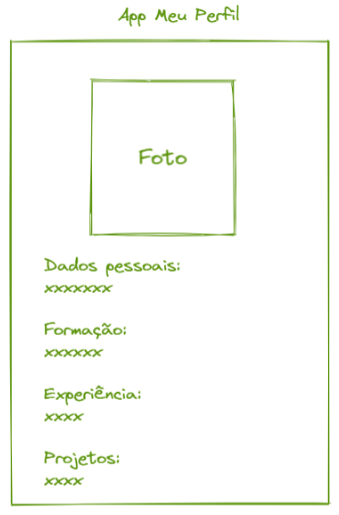

# Meu Perfil Profissional

Este é o primeiro de muitos exercícios da disciplina, onde desenvolvemos um exemplo simples de perfil profissional.

O código foi organizado em 6 componentes: ***Título***, ***Imagem***, ***Seção de Dados Pessoais***, ***Seção de Formação***, ***Seção de Experiência*** e ***Seção de Projetos***.

## Deploy
Veja o projeto em ação clicando no seguinte link:
[Deploy](https://snack.expo.dev/@isaquesv/ex1-1-meu-perfil-profissional)

## Outros Exercícios
- Gostou deste projeto? Que tal conferir uma versão mais organizada?
[Clique aqui para ver a melhoria!](https://github.com/isaquesv/PpDM_Tarefas/tree/master/ex1-2-meu-perfil-profissional-2)
- Quer explorar todos os projetos que desenvolvi até agora?
[Clique aqui para acessar a lista completa!](https://github.com/isaquesv/PpDM_Tarefas)