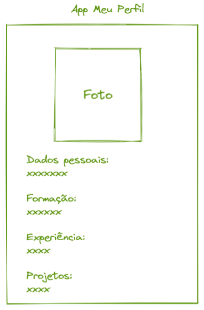

# Meu Perfil Profissional v2

Nesta versão, refatorei o exercício [Meu Perfil Profissional](), aprimorando sua estrutura e organização.

O código foi organizado em 3 componentes: ***TítuloPrincipal***, ***Imagem*** e ***Texto***.

ANesta versão, aplicamos o conceito de props, reutilizando o componente ***Texto*** em quatro seções: ***Dados Pessoais***, ***Formação***, ***Experiência*** e ***Projetos***.

## Deploy
Veja o projeto em ação clicando no seguinte link:
[Deploy](https://snack.expo.dev/@isaquesv/ex1-2-meu-perfil-profissional-2)

## Outros Exercícios
- Gostou deste projeto? Que tal conferir um contador de pessoas?
[Clique aqui e saiba mais!](https://github.com/isaquesv/PpDM_Tarefas/tree/master/ex2-contador-pessoas)
- Quer explorar todos os projetos que desenvolvi até agora?
[Clique aqui para acessar a lista completa!](https://github.com/isaquesv/PpDM_Tarefas)