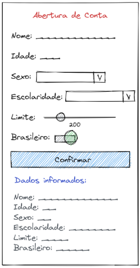

# App 10: Formulário de abertura de conta bancária

Neste exercício, criamos um formulário de abertura de conta bancária.

O código foi organizado em:
- ***1 Página "Formulario Abertura Conta Bancaria"***.
- ***Botao***.
- ***CampoDeTexto***.
- ***Range***.
- ***Select***.
- ***Titulo***.
- ***Toggle***.

## Deploy
Veja o projeto em ação clicando no seguinte link:
[Deploy](https://snack.expo.dev/@isaquesv/ex10-formulario-abertura-conta-bancaria)

## Outros Exercícios
- Quer explorar todos os projetos que desenvolvi até agora?
[Clique aqui para acessar a lista completa!](https://github.com/isaquesv/PpDM_Tarefas)