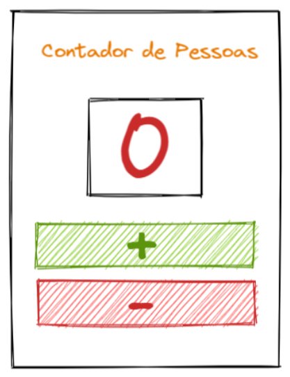

# Contador de Pessoas

Neste exercício, desenvolvemos um contador de pessoas para praticar componentes e eventos.

O código foi organizado em 3 componentes:
- ***Título***.
- ***Tela*** - exibe o número do contador.
- ***Botões*** - incrementam ou diminuem o valor.

## Deploy
Veja o projeto em ação clicando no seguinte link:
[Deploy](https://snack.expo.dev/@isaquesv/ex2-contador-pessoas)

## Outros Exercícios
- Gostou deste projeto? Que tal conferir um multiplicador de números?
[Clique aqui e saiba mais!](https://github.com/isaquesv/PpDM_Tarefas/tree/master/ex3-multiplicador-de-numeros)
- Quer explorar todos os projetos que desenvolvi até agora?
[Clique aqui para acessar a lista completa!](https://github.com/isaquesv/PpDM_Tarefas)