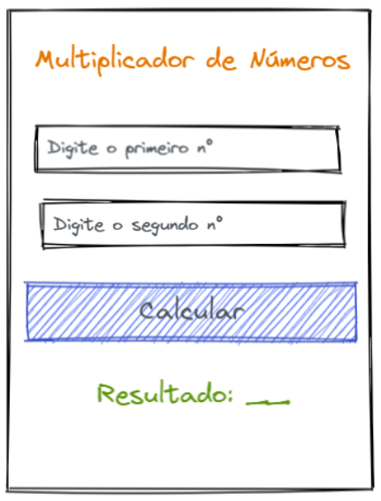

# Multiplicador de Números

Neste exercício, criamos um multiplicador de números para praticar a captura de entrada do usuário e eventos.

O código foi organizado em uma única página que contém:
- ***Título***.
- ***Entradas*** - campos para digitar os números a serem multiplicados.
- ***Botão*** - executa a multiplicação dos valores.
- ***Resultado*** - exibe o resultado da multiplicação.

## Deploy
Veja o projeto em ação clicando no seguinte link:
[Deploy](https://snack.expo.dev/@isaquesv/ex3-multiplicador-de-numeros)

## Outros Exercícios
- Gostou deste projeto? Que tal conferir um comparador de escolha entre álcool e gasolina?
[Clique aqui e saiba mais!](https://github.com/isaquesv/PpDM_Tarefas/tree/master/ex4-alcool-ou-gasolina)
- Quer explorar todos os projetos que desenvolvi até agora?
[Clique aqui para acessar a lista completa!](https://github.com/isaquesv/PpDM_Tarefas)