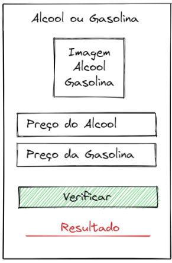

# Álcool ou Gasolina?

Neste exercício, desenvolvemos um comparador de escolha entre álcool e gasolina.

Enunciado: O cálculo básico para se descobrir se o álcool é vantajoso ou não em relação à gasolina é simples. Basta dividir o preço do litro do etanol pelo da gasolina. Se o resultado for inferior a 0,7, o derivado da cana-de-açúcar é o melhor para abastecer. Se for maior que 0,7, então a gasolina é melhor.

O código foi organizado em uma única página que contém:
- ***Título***.
- ***Imagem***.
- ***Entradas*** - campos para digitar os preços do álcool e da gasolina.
- ***Botão*** - executa a comparação.
- ***Resultado*** - exibe a melhor escolha.

## Deploy
Veja o projeto em ação clicando no seguinte link:
[Deploy](https://snack.expo.dev/@isaquesv/ex4-alcool-ou-gasolina)

## Outros Exercícios
- Gostou deste projeto? Que tal conferir uma calculadora IMC?
[Clique aqui e saiba mais!](https://github.com/isaquesv/PpDM_Tarefas/tree/master/ex5-calculo-imc)
- Quer explorar todos os projetos que desenvolvi até agora?
[Clique aqui para acessar a lista completa!](https://github.com/isaquesv/PpDM_Tarefas)