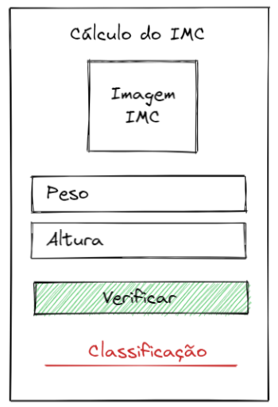

# Calculadora IMC

Neste exercício, desenvolvemos uma calculadora de IMC, aplicando a fórmula básica para determinar a classificação do peso de uma pessoa.

***Fórmula do IMC:*** IMC = Peso / (Altura * Altura).

| Classificação  | IMC |
| :------------- | :------------- |
| Abaixo do Peso  | Abaixo 18,5  |
| Peso Normal  | 18,5 - 24,9  |
| Sobrepeso  | 25 - 29,9  |
| Obesidade Grau I  | 30 - 34,9  |
| Obesidade Grau II  | 35 - 39,9  |
| Obesidade Grau III ou Mórbida  | Maior ou igual a 40 |

O código foi organizado em:
- ***1 Página "Calculadora De IMC"***.
- ***Título***.
- ***Entradas*** - campos para digitar o peso e a altura.
- ***Botão*** - executa o cálculo IMC.
- ***Resultado*** - exibe a classificação IMC.

## Deploy
Veja o projeto em ação clicando no seguinte link:
[Deploy](https://snack.expo.dev/@isaquesv/ex5-calculo-imc)

## Outros Exercícios
- Gostou deste projeto? Que tal conferir um jogo de adivinhação de um número aleatório de 0 a 10?
[Clique aqui e saiba mais!](https://github.com/isaquesv/PpDM_Tarefas/tree/master/ex6-jogo-numero-aleatorio)
- Quer explorar todos os projetos que desenvolvi até agora?
[Clique aqui para acessar a lista completa!](https://github.com/isaquesv/PpDM_Tarefas)