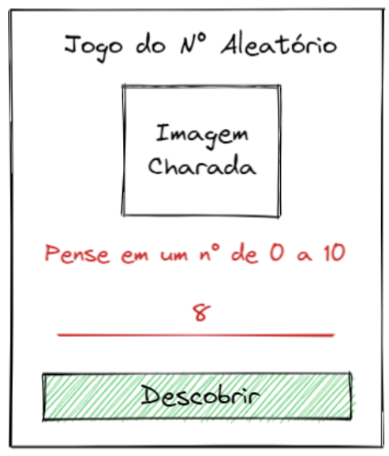

# Jogo de Adivinhação - Número Aleatório de 0 a 10

Neste exercício, criamos um jogo de adivinhação, onde o objetivo é tentar adivinhar um número aleatório gerado entre 0 e 10.

**Dica:** Para gerar um número aleatório de 0 a 10, você pode usar o função: ***Math.floor(Math.random() * 11)***.

O código foi organizado em:
- ***1 Página "Jogo Número Aleatório"***.
- ***Título***.
- ***Botão*** - sorteia um número de 0 a 10.
- ***Resultado*** - exibe o número sorteado.

## Deploy
Veja o projeto em ação clicando no seguinte link:
[Deploy](https://snack.expo.dev/@isaquesv/ex6-jogo-numero-aleatorio)

## Outros Exercícios
- Quer explorar todos os projetos que desenvolvi até agora?
[Clique aqui para acessar a lista completa!](https://github.com/isaquesv/PpDM_Tarefas)