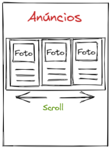

# App 07: Anúncios para venda de produtos (com Scroll View)

Neste exercício, criamos uma página de anúncios para venda de produtos com Scroll View horizontal.

O código foi organizado em:
- ***1 Página "Anuncios Vendas Produtos"***.
- ***Container Produtos***.
- ***Imagem*** - organiza as imagens dos produtos.
- ***Produto*** - organiza as informações dos produtos.
- ***Titulo***.

## Deploy
Veja o projeto em ação clicando no seguinte link:
[Deploy](https://snack.expo.dev/@isaquesv/ex7-anuncios-vendas-produtos)

## Outros Exercícios
- Gostou deste projeto? Que tal conferir uma página de vagas de empregos de TI?
[Clique aqui e saiba mais!](https://github.com/isaquesv/PpDM_Tarefas/tree/master/ex8-vagas-empregos-ti-scroll-view)
- Quer explorar todos os projetos que desenvolvi até agora?
[Clique aqui para acessar a lista completa!](https://github.com/isaquesv/PpDM_Tarefas)