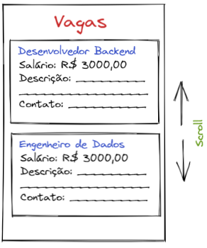

# Vagas de Emprego de TI (com Scroll View)

Neste exercício, criamos uma página de vagas de emprego de TI com Scroll View vertical.

O código foi organizado em:
- ***1 Página "Vagas Empregos TI"***.
- ***Container Vagas***.
- ***Titulo***.
- ***Vaga*** - organiza as informações das vagas.

## Deploy
Veja o projeto em ação clicando no seguinte link:
[Deploy](https://snack.expo.dev/@isaquesv/ex8-vagas-empregos-ti-scroll-view)

## Outros Exercícios
- Gostou deste projeto? Que tal conferir esta mesma página de vagas de empregos de TI feita com Flat List?
[Clique aqui e saiba mais!](https://github.com/isaquesv/PpDM_Tarefas/tree/master/ex9-vagas-empregos-ti-flat-list)
- Quer explorar todos os projetos que desenvolvi até agora?
[Clique aqui para acessar a lista completa!](https://github.com/isaquesv/PpDM_Tarefas)