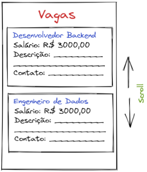

# Vagas de Emprego de TI (com Flat List)

Neste exercício, criamos uma página de vagas de emprego de TI com Flat List vertical.

O código foi organizado em:
- ***1 Página "Vagas Empregos TI"***.
- ***Container Vagas***.
- ***Titulo***.
- ***Vaga*** - organiza as informações das vagas.

## Deploy
Veja o projeto em ação clicando no seguinte link:
[Deploy](https://snack.expo.dev/@isaquesv/ex9-vagas-empregos-ti-flat-list)

## Outros Exercícios
- Gostou deste projeto? Que tal conferir um formulário de abertura de conta bancária?
[Clique aqui e saiba mais!](https://github.com/isaquesv/PpDM_Tarefas/tree/master/ex10-formulario-abertura-conta-bancaria)
- Quer explorar todos os projetos que desenvolvi até agora?
[Clique aqui para acessar a lista completa!](https://github.com/isaquesv/PpDM_Tarefas)